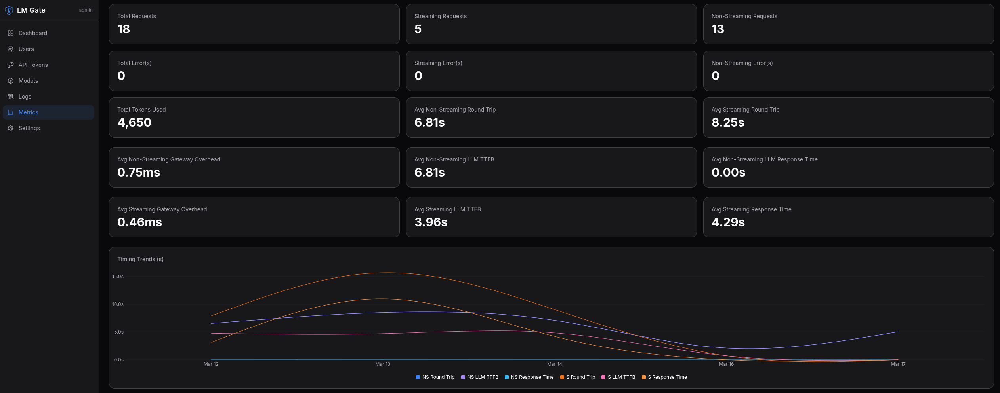
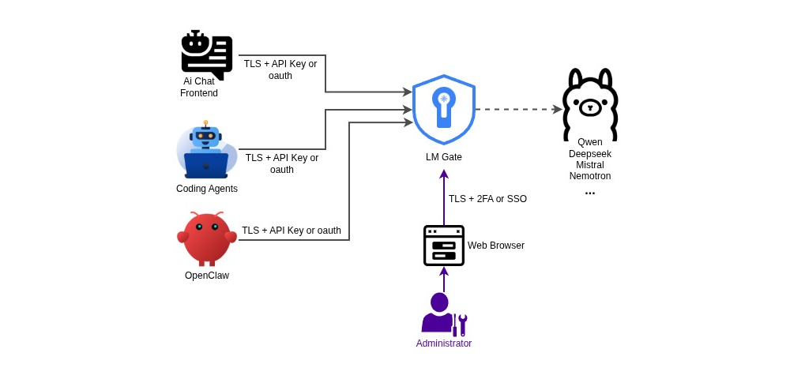

# LM Gate
maintained by: @hkdb



A high performance authentication and access-control gateway for LLM API backends such as [Ollama](https://ollama.com). LM Gate sits in front of your upstream model server and adds identity, authorization, rate limiting, and observability — without modifying the upstream service.

## 💡 Why
---

Most of the self-hosted LLM frameworks are designed to be run on local host with no authentication or rate limiting. However, the machine a user directly interacts with often lacks the GPU power their use cases demand. The result is a quiet but growing crisis: infrastructure built for the desktop, quietly bleeding onto the open internet.

A joint investigation between SentinelOne SentinelLABS and Censys revealed 175,000 unique Ollama hosts across 130 countries operating without authentication, forming an "unmanaged, publicly accessible layer of AI compute infrastructure." - [source](https://thehackernews.com/2026/01/researchers-find-175000-publicly.html)

The implications are serious. Security should be the default, not an afterthought requiring installation of multiple 3rd party components and expert configuration.

The current makeshift band-aid — adopted only by the more security-conscious and DevOps savvy — is to put self-hosted LLM frameworks behind an NGINX reverse proxy with basic auth. This is still not enough. In practice, credentials are often embedded directly in the URL — readable in plaintext by packet sniffers regardless of whether TLS is in use.

LM Gate is an attempt to change that — a single component to plug into your existing infrastructure to handle security, logging, and metrics needs, or deploy as a prepackaged single container bundled with Ollama.


## ✨ Features
---

- **Authentication** — API token authentication with JWT sessions guarded by local or OAuth2/OIDC single sign-on accounts with MFA
- **Multi-Factor Authentication** — TOTP authenticator apps, WebAuthn/passkeys, and one-time recovery codes with optional global 2FA enforcement
- **Password Policies** — configurable minimum length, complexity rules, expiry, max failed attempts with account lockout, and force-password-change on next login
- **Model ACLs** — per-user allow/deny rules with wildcard patterns controlling which models can be used
- **Rate Limiting** — per-user and per-token requests-per-minute limits with configurable global default
- **Allow Lists** - Allow lists for the admin panel and the API proxy path
- **Audit Logging** — separate API, admin, and security log streams with independent enable/disable toggles, per-type retention policies, and automatic daily pruning
- **Security Event Logging** — fail2ban-ready auth failure and rate-limit event logging to stdout with `[SECURITY]` prefix
- **Usage Metrics** — per-user, per-model token and request counts with daily/weekly/monthly aggregation, streaming vs non-streaming breakdown, and latency tracking
- **Admin Dashboard** — embedded SvelteKit SPA for managing users, tokens, models, ACLs, OIDC providers, audit logs (with CSV export), metrics, and system settings
- **Ollama Integration** - For Ollama backends, admins can directly pull and remove models
- **TLS** — bring your own certs, automatic Let's Encrypt, self-signed fallback, and HTTP→HTTPS redirect
- **Streaming** — full support for SSE and chunked responses from the upstream
- **Security Hardening** — configurable security headers (CSP, HSTS, X-Frame-Options, etc.), admin network restrictions (IP/CIDR whitelist), request/response body limits, and CORS controls
- **Docker Ready** — multi-stage build, single binary with embedded frontend, runs as non-root user

## 📦 Installation
---

| Type | Method | Description |
| --- |--------|-------------|
| 1 | [**Docker Standalone**](docs/STANDALONE.md) | LM Gate only, point to an existing LLM backend |
| 2 | [**Omnigate (CPU)**](docs/OMNIGATE.md) | All-in-one (Ollama + LM Gate) - CPU only |
| 3 | [**Omnigate (NVIDIA)**](docs/OMNIGATE.md) | All-in-one (Ollama + LM Gate) with NVIDIA GPU |
| 4 | [**Omnigate (AMD)**](docs/OMNIGATE.md) | All-in-one (Ollama + LM Gate) with AMD GPU |
| 5 | [**Binary**](docs/BINARY.md) | Download and run the binary directly |

Click on any of the environments above to get the step-by-step instructions for your environment or see [docs/INSTALL.md](docs/INSTALL.md) for step-by-step instructions for all environments in a single doc.

## ⚙️ Configuration
---

LM Gate uses a single `config.yaml` file. Every setting can also be overridden with a `LMGATE_`-prefixed environment variable. 

Users and admins should technically never need to touch the config.yaml directly as there's UI in the settings page to edit runtime configurations. Any custom config at launch time should be configured with environment variables.

See [docs/CONFIGS.md](docs/CONFIGS.md) for the full configuration reference.

LM Gate can gate OAuth2/oidc logins by a specific user group. This works out of the box for most OAuth2 providers except for Microsoft and Google. In the case that Microsoft and Google group gating is required, an intermediary auth layer must be setup to facilitate. See [docs/MGGROUPS.md](docs/MGGROUPS.md) for details.

See [docs/FAIL2BAN.md](docs/FAIL2BAN.md) for **fail2ban** integration instructions. 

## 🏗️ Architecture
---



**Under the hood:**

```
  Request                        HOT PATH                         Upstream
  ───────►  Auth ─► RateLimit ─► ModelACL ─► Proxy ──────────────► LLM
             │          │           │          │
             │          │           │          └── token extraction ──┐
             │          │           │              (async goroutine)  │
             │          │           │                                 │
             ▼          ▼           ▼                                 ▼
       ┌──────────────────────────────────────────────────────────────────┐
       │              OFF HOT PATH  (never blocks the request)            │
       │                                                                  │
       │  [SECURITY] stdout ◄── auth failures (401/403)                   │
       │  [SECURITY] stdout ◄── rate-limit hits (429)                     │
       │                                                                  │
       │  Audit Channel (cap 10k) ──► Batch Worker ──► SQLite (WAL)       │
       │    fire-and-forget send        100 rows or flush interval        │
       │    drops if full               per flush                         │
       │                                                                  │
       │  Metrics Collector ──► in-memory hourly buckets ──► SQLite       │
       │    (mutex, no I/O)     flush every 30s via upsert                │
       │                                                                  │
       │  Daily Pruner ── auto-deletes logs past retention                │
       └──────────────────────────────────────────────────────────────────┘
```

All logging, metrics, and token extraction run in background goroutines — **zero I/O on the hot path**. The audit middleware fires a goroutine that sends to a buffered channel and returns immediately; if the channel is full, the entry is dropped rather than blocking. Security events print a `[SECURITY]`-prefixed line to stdout for fail2ban, then enqueue the DB write asynchronously through the same channel.

Data is stored in a single SQLite database (WAL mode). The admin dashboard is a SvelteKit SPA compiled to static assets and embedded into the Go binary at build time.

**Scaling:**

LM Gate is designed to [scale deployments behind popular load balancers](docs/SCALE.md) and tested with NGINX.

### 🔒 TLS Modes
---

1. **Certificate files** — set `tls.cert_file` and `tls.key_file`
2. **Let's Encrypt (HTTP-01)** — set `tls.auto_cert.domain` and `tls.auto_cert.email`
3. **Let's Encrypt (DNS-01 via Cloudflare)** — set `tls.auto_cert.dns_provider: cloudflare` and `tls.auto_cert.cloudflare_api_token` (works behind firewalls, supports wildcards)
4. **Disabled** — set `tls.disabled: true` for development or when behind a reverse proxy

## 🛟 Support
---

If you have questions, identified a bug, or have a feature request, submit an issue [here](https://github.com/hkdb/lmgate/issues).

If you are a company looking for paid support of this product, contact 3DF via this [contact form](https://3df.io/#contact).

## 🔏 Security
---

See [SECURITY.md](SECURITY.md)

## 🛠️ Building from Source
---

See [docs/SETUP.md](docs/SETUP.md)

### 🏷️ Changelog
---

See [CHANGELOG.md](CHANGELOG.md)


### ⚠️ Disclaimer
---

While LM Gate is designed to be an enterprise-ready solution, it is currently still early-stage software and pending refinement and 3rd party audits.

LM Gate was developed with extensive use of Claude AI models.

### 💖 Sponsorships
---

If you like this project, please give the repo a star or feel free to buy us a coffee:

[](https://www.buymeacoffee.com/3dfosi)

Current Corporate Sponsors:

- [3DF](https://3df.io) and [3DF OSI](https://osi.3df.io)
- [dKloud](https://dkloud.io)

### 📋 Terms and Conditions
---

- [Terms of Use](docs/TERMS.md)
- [Privacy Policy](docs/PRIVACY.md)

## 📄 License
---

**Apache 2.0** - See [LICENSE](LICENSE) for details.
