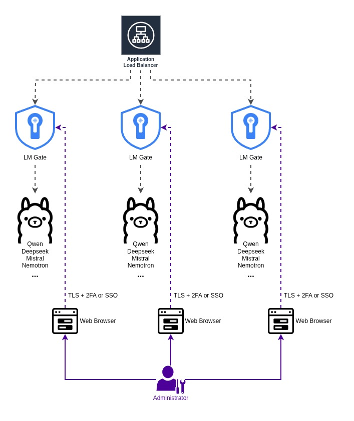

# Scaling

LM Gate is designed to scale deployments behind popular load balancers and tested with NGINX as per the below diagram:

In the future, there will be a separate dashboard catered to managing large scale deployments if there's enough demand.
